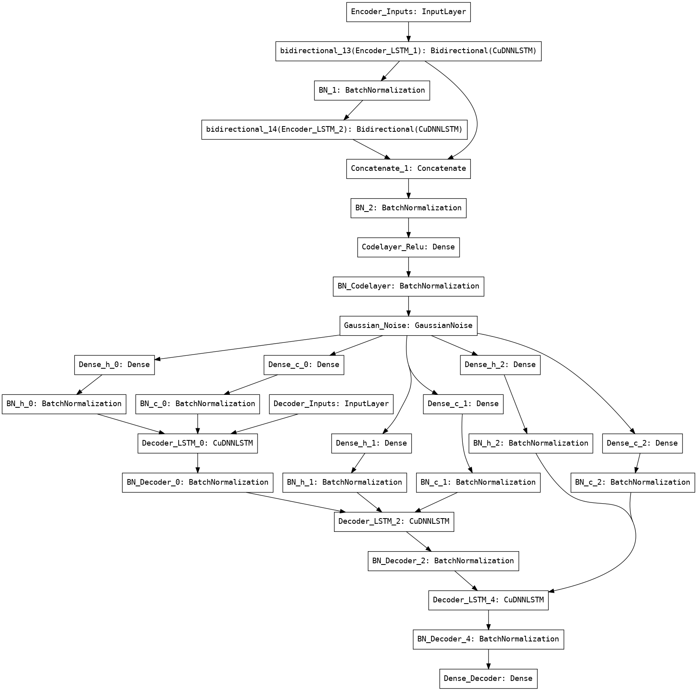

# Public repo for DeepDrugCoder (DDC).

    

### Installation
- Create a predefined Python3.6 conda environment by `conda create env file==ddc_env.yml`
- Run `python setup.py install` to install pip dependencies and add the package to the Python path.
- Add the environment in the drop-down list of jupyter by `python -m ipykernel install --user --name ddc_env --display-name "ddc_env (python_3.6.7)"`.

### Usage
- `conda activate ddc_env`
- `from ddc_pub import ddc_v3 as ddc`

Detailed breakdown of the full model:

